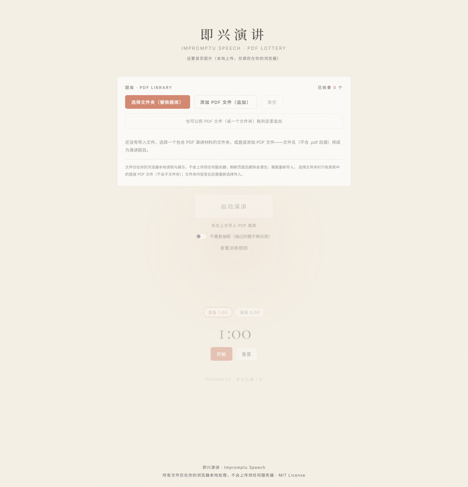
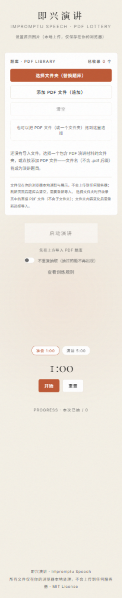

# WKJ-Present · 即兴演讲

一个**纯前端**的 PDF 随机演讲训练工具：把一个装满 PDF 演讲材料的文件夹导入网页，点击「启动演讲」随机抽中一套，立即在浏览器里打开阅读，配合准备 / 演讲计时器完成一次即兴演讲练习。

单文件、零依赖、零构建——`index.html` 就是全部。所有文件只在你的浏览器本地处理，不会上传到任何服务器。


## 为什么做这个

我们是一家管理咨询公司。今年新招了一批应届生，专业能力都不错，但普遍有一个短板：**拿到一个陌生话题，讲不出来**——不敢开口、没有结构、离不开稿子。

表达这件事，讲道理没有用，只能练。于是我们设计了这样一套训练方式：

> 每人随机抽一套陌生 PPT，1 分钟快速翻看，然后顺着页面讲 5 分钟。不讲得完美，只求讲顺、讲完整、讲得像一回事。

我们把「随机出题」做成了这个小工具，把「怎么生成随机题目」做成了配套的提示词工作流，内部跑了几轮之后觉得效果不错，就开源出来了。完整的训练规则（抽题、时间、反馈三问）见 [规则.md](规则.md)，也可以单人练习。

## 自带一套默认题库

仓库的 [`library/`](library/) 内置了 **12 套真实训练用 PDF**（每套约 15 页），主题全部是轻松的观察与脑洞：

> 如何优雅地浪费一个下午 · 一杯奶茶的社会学 · 地铁里的人类行为研究 · 如果猫统治了世界 · 如果天气预报改成情绪预报 · 为什么冰箱里总有一瓶没人喝完的饮料 · 为什么人类总是在周日晚上后悔 · 为什么我们总是买没用的小东西 · 一款不会让你沉迷的短视频App · 一款能读懂情绪的吹风机 · 一瓶让人更会聊天的矿泉水 · 一张可以自动变整洁的办公桌

把 `library/` 文件夹导入网页，就能立刻开始第一轮训练。

## 没有材料？用提示词自己生成

每套 PPT 题材都可以用 AI 批量生成，工作流分三步（提示词都在 [`prompts/`](prompts/) 里）：

1. **生成 PPT 提示词**：在豆包 / ChatGPT 等任何对话模型里，先发送 [元提示词-生成PPT内容方案.md](prompts/元提示词-生成PPT内容方案.md)，再发送你的主题。它会输出一份完整的 PPT 内容策划稿（定位、风格、逐页结构与讲法），效果见 [示例-地铁里的人类行为研究.md](prompts/示例-地铁里的人类行为研究.md)。
2. **生成 PPT**：复制这份策划稿，**新开一个对话窗口**，用 AI 生成 PPT 的模式（豆包「帮我做个 PPT」、Gamma 等）发给它，得到一套约 15 页的 PPT。
3. **导出与录入**：把生成的 PPT 导出为 PDF，放进一个文件夹，导入本工具即可。

仓库里的 12 套默认题库，就是用这个流程生成的。

## 功能

- **PDF 题库导入**
  - 选择文件夹（自动收录其中的直接子 PDF 文件，不含子文件夹），或直接多选 PDF 文件，或拖拽追加；
  - 自动展示文件总数和去掉 `.pdf` 后缀的文件名（扩展名大小写兼容），文件名即演讲题目；
  - 非 PDF 文件、空文件、伪造扩展名的文件会被自动拦截（读取文件头 `%PDF-` 校验）；
  - 重复导入自动去重（文件名 + 大小 + 修改时间指纹）；同名文件可共存，悬停可看完整来源；
  - 支持逐个移除、清空、重新选择文件夹替换整个题库。
- **随机抽题**
  - 从当前题库等概率抽取，抽中后展示题目并自动在新标签页打开对应 PDF；
  - 默认每次独立随机；可选「不重复抽取」模式，抽完提示重置；
  - 空库不可抽签，有明确引导；动画期间防连点；
  - 浏览器拦截弹窗时，页面内保留「阅读 PDF」「下载 PDF」按钮兜底，没有死路。
- **演讲计时器**：准备 1:00 / 演讲 5:00 两档，开始 / 暂停 / 重置，最后 30 秒变红提醒。
- **首页图片**：默认纯文字标题；可从本地上传自己的 Logo / 头图（自动压缩后仅保存在你自己浏览器的 localStorage 中，可一键恢复默认）。
- **训练规则**：内置弹窗版训练规则（准备、演讲、反馈的完整流程）。

| 桌面默认态 | 手机端 |
| --- | --- |
|  |  |

## 快速开始

不需要安装任何东西：

```bash
git clone https://github.com/Keji-Wang/WKJ-Present.git
cd WKJ-Present
# 直接双击 index.html 也能用；或起一个本地静态服务：
python -m http.server 8000
# 打开 http://localhost:8000
```

想立刻体验：把仓库里的 [`library/`](library/) 文件夹导入网页，即可开始第一轮训练。

### 部署

纯静态，任意静态托管均可。GitHub Pages：仓库设置里把 `main` 分支根目录设为 Pages 源即可。所有资源都是相对路径，部署在子路径（如 `https://<user>.github.io/WKJ-Present/`）也能正常工作。

## 隐私与数据边界

- 你导入的 PDF **只在浏览器内存中被读取和展示**，没有任何网络请求会发送文件内容；
- 首页图片（如选择上传）仅保存在你本地浏览器的 localStorage，不经过任何服务器；
- 页面唯一的第三方请求是 Google Fonts 字体（可自行移除 `<head>` 中的两行 `<link>`，回退到系统字体）。

## 浏览器兼容与已知限制（如实说明）

| 行为 | 实际情况 |
| --- | --- |
| 文件夹选择 | Chrome / Edge / Firefox / Safari 现代版均支持；不支持的浏览器请用「添加 PDF 文件」多选入口 |
| 只收录直接子文件 | 选择文件夹时**只收录其中的直接 PDF 文件**，子文件夹中的文件会被跳过并有提示 |
| 文件夹内容变化 | 浏览器无法持续监控磁盘目录——文件夹内容变化后需**重新选择导入** |
| 刷新页面 | 题库保存在内存中，**刷新后会清空**，需要重新导入（这是有意的：不申请任何持久化权限） |
| PDF 内嵌预览 | 桌面浏览器在结果卡下方内嵌预览；**手机浏览器内嵌 PDF 支持不稳定**，移动端自动替换为「新标签页打开」提示 |
| 弹窗拦截 | 抽签会在你的点击手势内同步预开新标签页以绕过拦截；若仍被拦截，结果卡上的「阅读 PDF / 下载 PDF」按钮始终可用 |
| 文件协议 | 直接双击 `index.html`（file://）即可使用；建议本地起静态服务获得完整体验 |

## 目录结构

```
WKJ-Present/
├── index.html    # 全部应用（HTML + CSS + JS，单文件零依赖）
├── library/      # 12 套真实训练用默认题库（AI 生成的虚构主题 PDF）
├── prompts/      # PPT 内容生成提示词（元提示词 + 实例效果）
├── 规则.md        # 完整训练规则（抽题、时间、反馈方式）
└── docs/screenshots/  # 截图
```

## 设计取舍

- **单文件、零依赖**：不引入 PDF.js 等查看库——现代浏览器自带 PDF 查看器足够好，不值得为一个预览功能背几 MB 依赖；
- **不做登录 / 数据库 / 云存储**：题库本来就是「从本机选、在本机用」，持久化反而引入权限和隐私负担；
- **文件名即题目**：不维护额外的题目清单，重命名文件就是改题目；
- **随机性**：使用 `Math.floor(Math.random() * n)` 均匀覆盖全部索引（已验证 0..n-1 无越界、无漏抽），不做伪「抽奖动画权重」；
- **默认态即开源态**：仓库不包含任何私有品牌素材；`logo.png` 若存在（未被 git 跟踪）会显示在标题上方，方便自部署者放置自己的 Logo。

## 开发

无构建步骤。`index.html` 中暴露了一个只读测试钩子 `window.__impromptu`（`addFiles` / `draw` / `pickIndex` / `getState` 等），便于在浏览器控制台或自动化测试中驱动导入与抽取逻辑。

## 联系

X（Twitter）：[@JiafuWang](https://x.com/JiafuWang)

## License

[MIT](LICENSE) · 默认题库与提示词均为 AI 生成的虚构原创内容，可自由分发。
