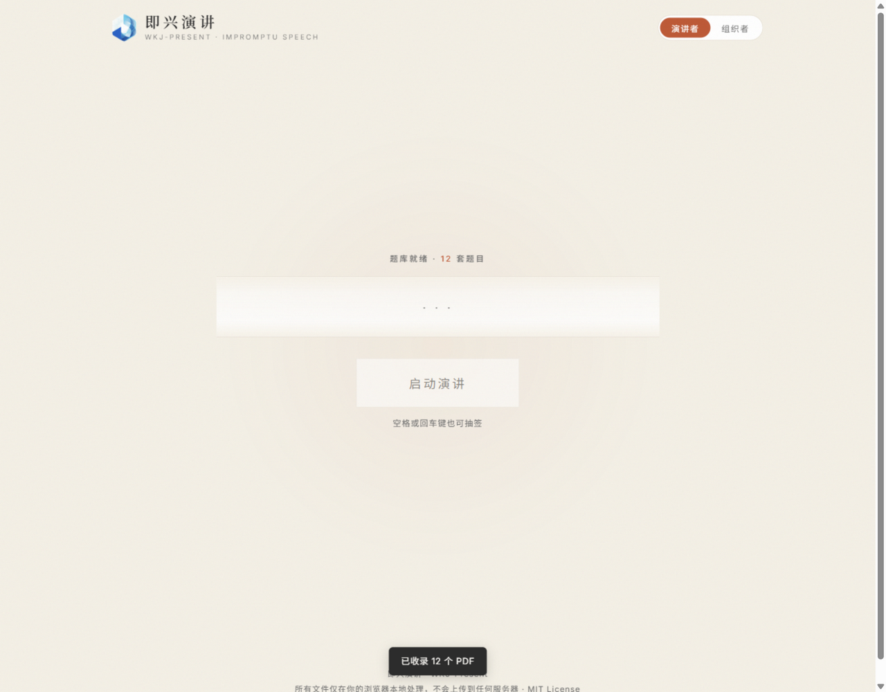
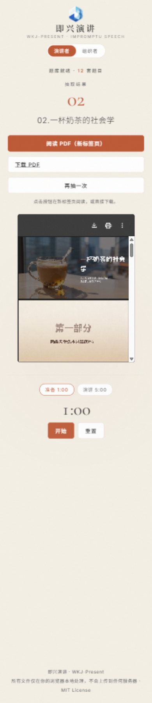

# WKJ-Present · 即兴演讲

[](LICENSE)

一个**纯前端**的 PDF 随机演讲训练工具：组织者维护题库与规则，演讲者滚动抽一套陌生 PDF 立即开讲——**抽题定格之前，演讲者看不到任何题目列表**，保持未知的紧张感。

应用本体是单 HTML 文件、零构建（内嵌一个 PDF.js 渲染库用于第一页预览）。所有文件只在你的浏览器本地处理，不会上传到任何服务器。

## 在线体验

**👉 [https://keji-wang.github.io/wkj-present/](https://keji-wang.github.io/wkj-present/)**

零安装，打开即玩：页面会自动加载内置的 12 套训练题库（AI 生成的虚构主题演示材料，每套约 15 页），点「启动演讲」就能完整体验下面这套流程。

## 30 秒看懂玩法

1. 点击「启动演讲」，题目在滚轮中加速滚动；
2. 滚轮减速、定格，揭晓题号和题目——抽中之前你不知道会是什么；
3. 定格后页面内直接渲染这套 PDF 的第一页，先看清要讲的是什么；想看完整文件再点「打开 PDF」（新标签页）或「下载 PDF」；
4. 下方是计时器：准备 1:00 → 演讲 5:00，最后 30 秒变红提醒。

| ① 待机 | ② 滚动抽取 | ③ 定格：PDF 与计时 |
| --- | --- | --- |
|  |  |  |

（以上为真实界面截图；内置题库为 AI 生成的虚构演示材料。手机端效果见 [mobile-stage.png](docs/screenshots/mobile-stage.png)，组织者管理界面见 [organizer.png](docs/screenshots/organizer.png)。）

## 两种使用方式

### 在线使用（推荐）

零安装。[GitHub Pages](https://keji-wang.github.io/wkj-present/) 上打开即用，内置题库自动加载；**刷新页面后内置题库也会自动重新加载**，不需要任何准备步骤。所有文件只在你的浏览器内存中处理，不经过任何服务器。

### 本地运行

```bash
git clone https://github.com/Keji-Wang/wkj-present.git
cd wkj-present
python -m http.server 8000
# 打开 http://localhost:8000
```

通过 HTTP 访问时行为与在线版一致。注意：直接双击 `index.html`（file:// 协议）打开时，浏览器安全策略禁止页面读取本地文件，**内置题库无法自动加载**，页面会保持空题库状态，需要在组织者视图中手动导入 `library/` 文件夹。

### 题库的加载与刷新行为

| 题库 | 加载 | 刷新页面后 |
| --- | --- | --- |
| 内置题库（`library/`） | HTTP 访问时自动加载 | 自动重新加载 |
| 手动导入的自定义文件 | 即时生效，仅保存在内存中 | **清空**，需重新导入 |

## 为什么做这个

我们是一家管理咨询公司。今年新招了一批应届生，专业能力都不错，但普遍有一个短板：**拿到一个陌生话题，讲不出来**——不敢开口、没有结构、离不开稿子。

表达这件事，讲道理没有用，只能练。于是我们设计了这样一套训练方式：

> 每人随机抽一套陌生 PPT，1 分钟快速翻看，然后顺着页面讲 5 分钟。不讲得完美，只求讲顺、讲完整、讲得像一回事。

我们把「随机出题」做成了这个小工具，把「怎么生成随机题目」做成了配套的提示词工作流，内部跑了几轮之后觉得效果不错，就开源出来了。完整的训练规则（抽题、时间、反馈三问）见 [规则.md](规则.md)，也可以单人练习。

## 内置题库：12 套虚构演示材料

仓库的 [`library/`](library/) 内置了 **12 套真实训练用 PDF**（每套约 15 页），主题全部是轻松的观察与脑洞：

> 如何优雅地浪费一个下午 · 一杯奶茶的社会学 · 地铁里的人类行为研究 · 如果猫统治了世界 · 如果天气预报改成情绪预报 · 为什么冰箱里总有一瓶没人喝完的饮料 · 为什么人类总是在周日晚上后悔 · 为什么我们总是买没用的小东西 · 一款不会让你沉迷的短视频App · 一款能读懂情绪的吹风机 · 一瓶让人更会聊天的矿泉水 · 一张可以自动变整洁的办公桌

在线访问时打开即自动加载，无需导入；想换成自己的材料，在组织者视图中选择文件夹替换即可。

## 没有材料？用提示词自己生成

每套 PPT 题材都可以用 AI 批量生成，工作流分三步（提示词都在 [`prompts/`](prompts/) 里）：

1. **生成 PPT 提示词**：在豆包 / ChatGPT 等任何对话模型里，先发送 [元提示词-生成PPT内容方案.md](prompts/元提示词-生成PPT内容方案.md)，再发送你的主题。它会输出一份完整的 PPT 内容策划稿（定位、风格、逐页结构与讲法），效果见 [示例-地铁里的人类行为研究.md](prompts/示例-地铁里的人类行为研究.md)。
2. **生成 PPT**：复制这份策划稿，**新开一个对话窗口**，用 AI 生成 PPT 的模式（豆包「帮我做个 PPT」、Gamma 等）发给它，得到一套约 15 页的 PPT。
3. **导出与录入**：把生成的 PPT 导出为 PDF，放进一个文件夹，在组织者视图中导入即可。

仓库里的 12 套默认题库，就是用这个流程生成的。

## 两个角色的完整功能

### 演讲者视图（打开页面默认看到的就是它）

- 滚动抽取：等概率抽取，先定结果、后放动画，定格的必然是抽中的那套；
- 揭晓即预览：定格后在页面内渲染 PDF 第一页（PDF.js 客户端渲染，桌面与手机端一致）；「打开 PDF / 下载 PDF」按钮随时可用，打开动作由你主动触发，抽完不会被强制跳页；
- 计时开讲：准备 1:00 / 演讲 5:00 两档，开始 / 暂停 / 重置；
- 空格 / 回车键也可抽签；空库时给出明确引导。

### 组织者视图（右上角切换）

- **题库管理**：选择文件夹（自动收录其中的直接子 PDF 文件，不含子文件夹）、多选追加、拖拽导入；自动展示文件总数和去掉 `.pdf` 后缀的文件名（扩展名大小写兼容），文件名即演讲题目；非 PDF、空文件、伪造扩展名的文件自动拦截（读取文件头 `%PDF-` 校验）；重复导入自动去重（文件名 + 大小 + 修改时间指纹）；同名文件可共存，悬停可看完整来源；支持逐个移除、清空、换库、一键恢复内置题库；
- **抽签设置**：「不重复抽取」模式（抽完提示重置）、抽签记录网格与一键重置；
- **训练规则**：内置完整训练规则弹窗，开场前向演讲者说明；
- **展示设置**：可上传自己的 Logo / 首页图片（自动压缩后仅保存在你自己浏览器的 localStorage 中，可一键恢复默认）。

| 组织者视图 | 手机端 |
| --- | --- |
|  |  |

## 隐私与数据边界

- 你导入的 PDF **只在浏览器内存中被读取和展示**，没有任何网络请求会发送文件内容；
- 首页图片（如选择上传）仅保存在你本地浏览器的 localStorage，不经过任何服务器；
- 页面的第三方请求只有 Google Fonts 字体（可自行移除 `<head>` 中的两行 `<link>`，回退到系统字体）；第一页预览使用的 PDF.js 渲染库已内嵌在仓库中（`vendor/pdfjs/`），不产生任何运行时外部请求。

## 浏览器兼容与已知限制（如实说明）

| 行为 | 实际情况 |
| --- | --- |
| 内置题库自动加载 | 需 HTTP 访问（GitHub Pages / 本地静态服务）；`file://` 直开时浏览器禁止页面读取本地文件，自动加载会跳过，需手动导入（详见「两种使用方式」） |
| 题库与刷新 | 内置题库刷新后自动重新加载；手动导入的自定义文件仅存内存，刷新后清空、需重新导入（有意不申请持久化权限） |
| 文件夹选择 | Chrome / Edge / Firefox / Safari 现代版均支持；不支持的浏览器请用「添加 PDF 文件」多选入口 |
| 只收录直接子文件 | 选择文件夹时**只收录其中的直接 PDF 文件**，子文件夹中的文件会被跳过并有提示 |
| 文件夹内容变化 | 浏览器无法持续监控磁盘目录——文件夹内容变化后需**重新选择导入** |
| 第一页预览 | 由内嵌的 PDF.js 在你的浏览器本机渲染，桌面与手机端一致，无外部 CDN 依赖；渲染异常时预览区提示降级，「打开 PDF / 下载 PDF」不受影响 |
| 弹窗行为 | 抽签后**不会自动打开任何新标签页**；是否打开完整 PDF、何时打开，完全由你点「打开 PDF」决定 |

## 目录结构

```
wkj-present/
├── index.html    # 全部应用（HTML + CSS + JS，单文件零构建）
├── library/      # 12 套真实训练用默认题库（AI 生成的虚构主题 PDF）+ manifest.json 清单
├── prompts/      # PPT 内容生成提示词（元提示词 + 实例效果）
├── vendor/pdfjs/ # 内嵌的 PDF.js 渲染库（Apache-2.0，用于第一页预览）
├── 规则.md        # 完整训练规则（抽题、时间、反馈方式）
└── docs/screenshots/  # 截图
```

## 设计取舍

- **双角色分离**：演讲者视图刻意做得极简——没有题目列表、没有管理入口的干扰，保持「抽到什么讲什么」的未知感；所有运维工作收进组织者视图；
- **先定结果、后放动画**：点击瞬间就等概率抽定结果，滚动动画只是揭晓仪式，时间基准保证到点必定格，定格的必然是抽中的那套；
- **单文件、零构建**：应用本身是单 HTML；为「定格即见第一页」内嵌了 PDF.js 渲染库（Apache-2.0，`vendor/pdfjs/`），仍无任何构建步骤与运行时外部依赖；
- **不做登录 / 数据库 / 云存储**：题库本来就是「从本机选、在本机用」，持久化反而引入权限和隐私负担；
- **文件名即题目**：不维护额外的题目清单，重命名文件就是改题目；
- **随机性**：使用 `Math.floor(Math.random() * n)` 均匀覆盖全部索引（已验证 0..n-1 无越界、无漏抽），不做伪「抽奖动画权重」；
- **默认态即开源态**：仓库不包含任何私有品牌素材；`logo.png` 若存在（未被 git 跟踪）会显示在标题旁，方便自部署者放置自己的 Logo。

## 开发

无构建步骤。`index.html` 中暴露了一个只读测试钩子 `window.__impromptu`（`addFiles` / `draw` / `pickIndex` / `getState` 等），便于在浏览器控制台或自动化测试中驱动导入与抽取逻辑。

## 联系

X（Twitter）：[@JiafuWang](https://x.com/JiafuWang)

## License

[MIT](LICENSE) · 默认题库与提示词均为 AI 生成的虚构原创内容，可自由分发。

## 第三方声明

- [PDF.js](https://github.com/mozilla/pdf.js)（内嵌于 `vendor/pdfjs/`）— Mozilla 及贡献者，[Apache-2.0](https://github.com/mozilla/pdf.js/blob/main/LICENSE)
